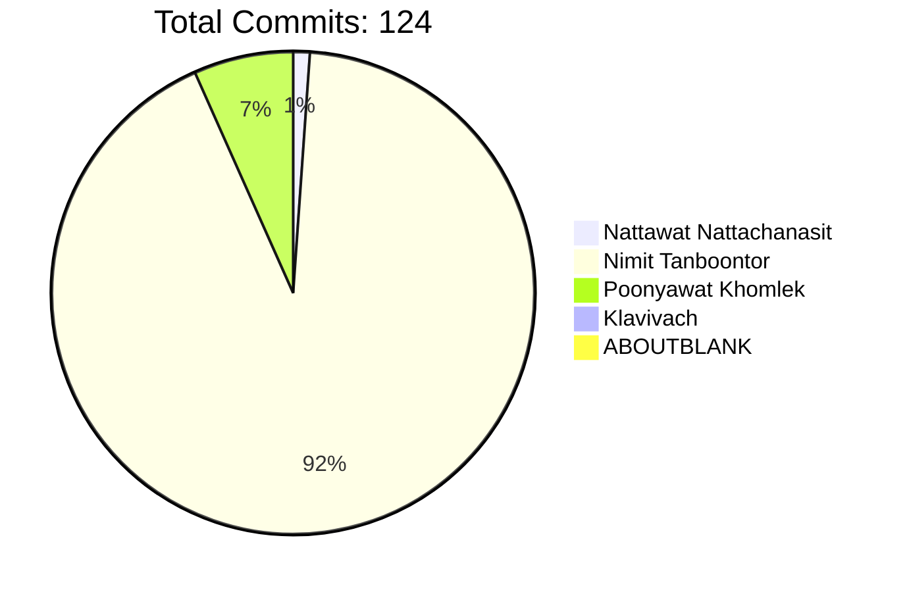

# HLLC-2025

HLLC-2025 is a comprehensive platform for campus management and student engagement built with modern technologies and following clean architecture principles.

## 🚀 Project Overview

This project provides a scalable and maintainable solution for:
- User management with role-based access control
- Authentication and authorization
- School and major/department management
- Activity tracking and check-in system
- Real-time chat functionality
- Comprehensive reporting and analytics

## ⚙️ System Architecture

The system is built using a modular microservice architecture:

### Backend Services
- **User Service**: User management and profile handling
- **Auth Service**: Authentication, session management, and authorization
- **School Service**: School and institution management
- **Major Service**: Academic major/department management
- **Activity Service**: Event and activity tracking
- **Check-in Service**: Attendance and check-in system
- **Chat Service**: Real-time messaging functionality
- **Notification Service**: Alert and notification delivery

### Technologies
- **Backend**: Go 1.24.1, Fiber, gRPC, MongoDB, Redis
- **Frontend**: React, Material UI, WebSockets
- **DevOps**: Docker, GitHub Actions, Kubernetes
- **Monitoring**: Prometheus, Grafana

## 🛠️ Project Structure

The project follows a clean architecture approach with clear separation between layers:

```
HLLC-2025/
├── backend/             # Go backend services
│   ├── config/          # Configuration management
│   ├── module/          # Service modules
│   ├── pkg/             # Shared utilities
│   └── server/          # Server initialization
├── frontend/            # React frontend application
├── docs/                # Documentation
├── scripts/             # Utility scripts
└── .github/             # GitHub Actions workflows
```

## 👥 Contributors

### Team Members and Contributions

<table>
<tr>
    <th>GitHub Username</th>
    <th>Name</th>
    <th>Contributions</th>
    <th>Statistics</th>
</tr>

<tr>
    <td><a href="https://github.com/jemiezler">jemiezler</a></td>
    <td>Nattawat Nattachanasit</td>
    <td>
        <b>Role:</b> Team Lead / Project Manager / Full Stack Developer<br/>
        <b>Responsibilities:</b>
        <ul>
            <li>Project Management & Client Communication</li>
            <li>Frontend Design & Implementation</li>
            <li>DevOps & Deployment</li>
            <li>Frontend Architecture & Layout Design</li>
        </ul>
    </td>
    <td align="center">
        
        
        <br/>
        <b>0.81% of total contributions</b>
    </td>
</tr>

<tr>
    <td><a href="https://github.com/6531503042">6531503042</a></td>
    <td>Nimit Tanboontor</td>
    <td>
        <b>Role:</b> Backend Developer / Architect<br/>
        <b>Responsibilities:</b>
        <ul>
            <li>Backend Architecture Design</li>
            <li>Core Service Implementation (User, Auth)</li>
            <li>Decorator Pattern & Middleware</li>
            <li>Database Schema & Service Structure</li>
        </ul>
    </td>
    <td align="center">
        
        
        <br/>
        <b>66.94% of total contributions</b>
    </td>
</tr>

<tr>
    <td><a href="https://github.com/poonyawat0511">poonyawat0511</a></td>
    <td>Poonyawat Khomlek</td>
    <td>
        <b>Role:</b> Backend Developer<br/>
        <b>Responsibilities:</b>
        <ul>
            <li>Chat System Implementation</li>
            <li>Real-time Data Processing</li>
            <li>Backend Service Development</li>
            <li>API Integration & Testing</li>
        </ul>
    </td>
    <td align="center">
        
        
        <br/>
        <b>4.84% of total contributions</b>
    </td>
</tr>

<tr>
    <td><a href="https://github.com/klavivach">klavivach</a></td>
    <td>Klavivach</td>
    <td>
        <b>Role:</b> Frontend Developer / QA Tester<br/>
        <b>Responsibilities:</b>
        <ul>
            <li>Chat UI Implementation</li>
            <li>Frontend Component Development</li>
            <li>Testing & Quality Assurance</li>
            <li>Frontend-Backend Integration</li>
        </ul>
    </td>
    <td align="center">
        
        
        <br/>
        <b>0.0% of total contributions</b>
    </td>
</tr>

<tr>
    <td><a href="https://github.com/aboutblank0000000">aboutblank0000000</a></td>
    <td>ABOUTBLANK</td>
    <td>
        <b>Role:</b> UI/UX Designer<br/>
        <b>Responsibilities:</b>
        <ul>
            <li>Coming soon</li>
            <li>Role to be determined</li>
        </ul>
    </td>
    <td align="center">
        
        
        <br/>
        <b>0.0% of total contributions</b>
    </td>
</tr>

</table>

### Contribution Distribution


## 📋 Current and Upcoming Modules

### Implemented Services
- User Management
- Authentication & Authorization
- School Management
- Major/Department Management

### Upcoming Services
- Activity Management
- Check-in System
- Chat System
- Lamduan Integration
- Notifications
- Reporting & Analytics

## 🚀 Getting Started

### Prerequisites
- Go 1.24.1 or newer
- MongoDB
- Redis
- Node.js and npm

### Setup and Installation
1. Clone the repository
2. Set up environment variables for backend services
3. Install backend dependencies: `cd backend && go mod download`
4. Install frontend dependencies: `cd frontend && npm install`
5. Run the backend services: `cd backend && go run main.go api`
6. Run the frontend: `cd frontend && npm start`

## 📄 Documentation

Comprehensive documentation is available in the `/docs` directory and includes:
- API Reference
- User Guides
- Architecture Overview
- Development Guidelines

## 🤝 Contributing

We welcome contributions to the HLLC-2025 project:

1. Fork the repository
2. Create your feature branch
3. Commit your changes
4. Push to the branch
5. Open a pull request

Please follow our coding standards and guidelines when contributing.

## 📜 License

This project is licensed under the MIT License - see the LICENSE file for details.
